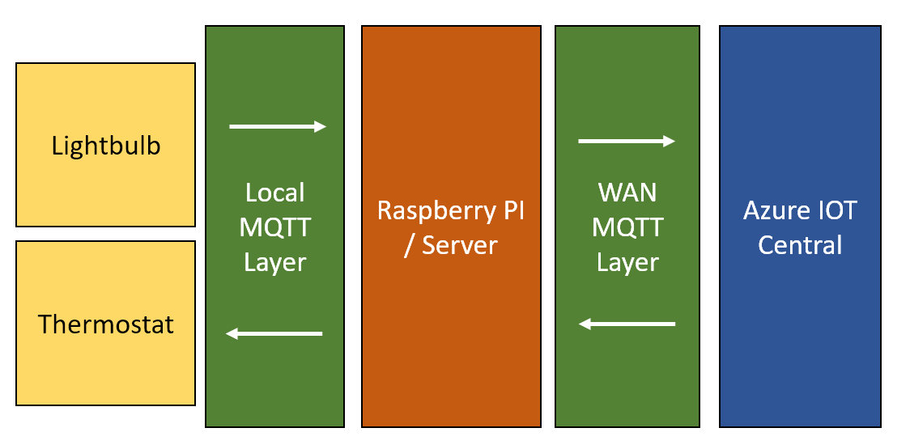
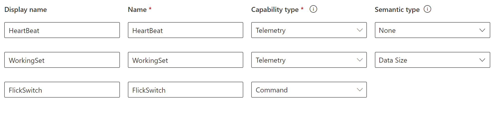
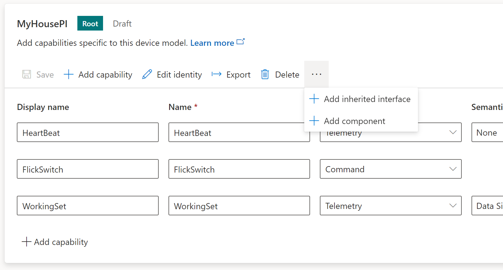
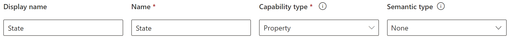
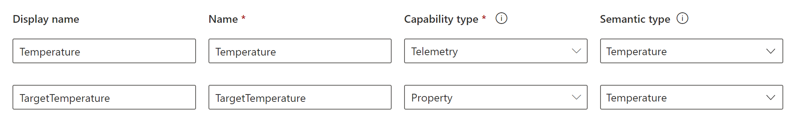
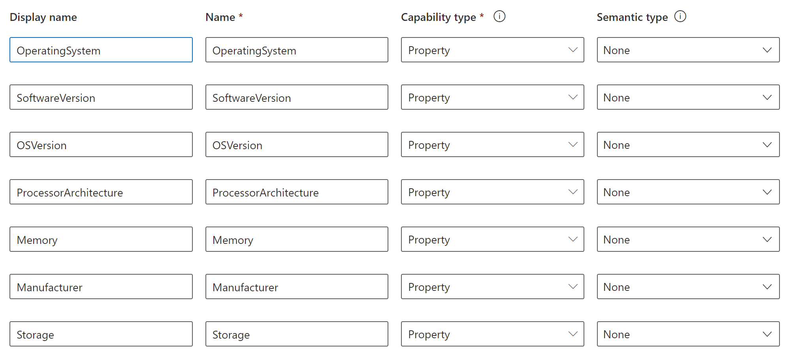

# HSS2 - Session 3 - Azure IOT Central
## Requirements
- Docker
- WSL
- dotnet 6

## MyHome
MyHome allows you to use a Raspberry PI as a bridge between a local MQTT, and the Azure IOT Central. 
MyHome links the Raspberry PI to a `Device` in Azure IOT Central.
We will then be able to connect other devices within the same Network by using a local MQTT communication channel.
These connected devices will be treated as `Components` of the root Device (the RaspberryPI).

The following diagram displays what would it look like if we connected two components, a Lightbulb and a Thermostat
into the RaspberryPI.

## Features
- Monitor Thermostat Temperature by using Telemetry
- Allow control from IOT Central to Flick the switch of the lightbulb.
- Allow Ligthbulb state property to be updated in the cloud.
- Allow IOT Central to regulate Thermostat from the cloud using a Twin Device (TODO).

## MyHome Device Properties
### Thermostat
- Temperature (Telemetry)
- TargetTemperature (Writable Property)

### Lightbulb
- FlickSwitch (Command)

## Device Information (From RaspberryPI)
- OperatingSystem
- Software Version
- OSVersion
- ProcessorArchitecture
- Memory
- Manufacturer
- Storage

# Azure Portal
First we need to create a new Azure IOT Central resource.
- In the Azure Portal go to 'Create Resource' and search for `IoT Central application`
- Fill in the custom data
- On Template select 'Custom Template'
- Pricing plan Standard 2 [gives you 30,000 free monthly messages](https://azure.microsoft.com/en-us/pricing/details/iot-central/).
- Click on Review and Create
- Wait for creation wizard to complete.
- Go to resource and look for the `IoT Central Application URL` property in the Overview Tab.
This will take you to your Azure IOT Central application.

# Azure IOT Central
## Create Custom Device Template
In order to configure a new Device, a Device Template is required to dictate the data structure
of the device. In other words, what are the data signals that will be comunicated to Azure IOT.

Azure IOT Central already comes with a lot of preconfigured Device Templates that match known
commercial hardware, but for our case we want to create a new `Custom Template`
- Go to Device Templates and Click in + New to start creating a new template.
- Select IOT Device
- Set a Template Name. i.e `MyHomePI`
- Leave 'This is a gateway' device check unmarked.
- Create the new Device Template.

## Adding Capabilities
After creating our template we can Explore Templates and Edit MyHomePI to add
the basic Capabilities the RaspberryPI will handle.
- Add the Following Capabilities and save changes:

**HeartBeat**:
This will let the device know that it's connected by providing a heart beat every configured amount of time.
**FlickSwitch**:
This will trigger a command that will direct MyHousePI to turn the light bulb on if it's off, and off if it's on.
**WorkingSet**:
This will keep track of the Memory consumed by the MyHousePI.

## Adding Components
In the same View where Capabilities are added, search for the 'dotted' menu item:

### LightBulb
- Select Add Component
- Select Custom Component
- Click on `Edit Identity` Option
- Change the Display Name to `LightBulb`
- Add the Following Capability and save changes:

### Thermostat
- Go back to the Root Component by clicking `MyHousePI` on the left menu.
- Select Add Component
- Select Custom Component
- Click on `Edit Identity` Option
- Change the Display Name to `Thermostat`
- Add the Following Capabilities and save changes:

### DeviceInformation:
- Go back to the Root Component by clicking `MyHousePI` on the left menu.
- Select Add Component
- Select Custom Component
- Click on `Edit Identity` Option
- Change the Display Name to `DeviceInformation`
- Add the Following Capabilities and save changes:

## Publish
Once all capabilities have been added, you can publish the project.

# Running the Docker Containers
The projects are all setup to run within a docker container.
- Download the repository into the device where you want to run this container.
- Open a linux bash using WSL (Ubuntu or Debian)
- Go to the root folder of the repository
- Go to the docker dir by using `cd docker`
- Build the solution with `./publish.sh`
- initiate the container with `sudo docker compose up --build`

### Setup Credentials of your device in the portal.
- Navigate to `http://localhost:8888` to access the MyHome portal.
- Go to the `Device` tab
- Fill the blanks with the Data from your Template and Device
- Click on Register Device

If all went well, and the data was entered correctly, the device should connect after this,
and it should be sending the required telemetry and properties to the IOT central.